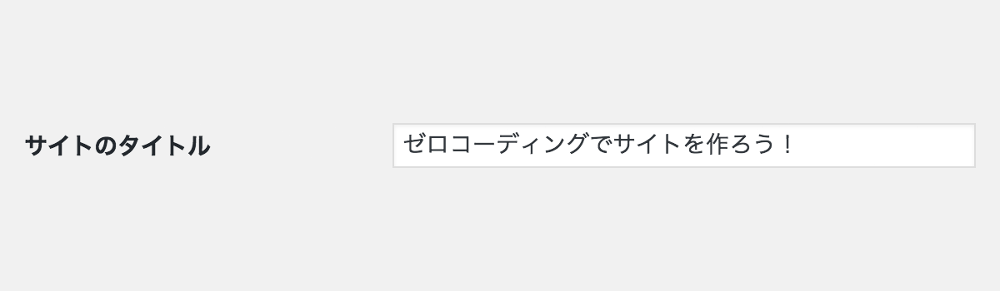

# ゼロコーディングで WordPress サイト制作ハンズオン

## WordPress の基本設定

- 言語設定
- サイトのタイトル設定
- サイトのキャッチフレーズ設定
- タイムゾーン
- 日付のフォーマット
- 時刻フォーマット
- 検索エンジンへの設定
- ディスカッション設定
- パーマリンク設定

まずはログインしてください。

```
http://あなたの WordPress をインストールした環境/wp-login.php
```

以下、画面から「ユーザー名またはメールアドレス」と「パスワード」を入力し、ログインしてください。


ログインできたら、ダッシュボードの 設定 ＞ 一般 の設定画面へ


### 言語設定

今回は日本語の環境で作業を行います。  
設定 ＞ 一般 ＞ サイトの言語 から「日本語」を選択してください。


一旦、「変更を保存」します。  
ダッシュボードのメニューがすべて日本語に切り替わってますでしょうか？

### サイトのタイトル設定

設定 ＞ 一般 ＞ サイトのタイトル にお好きなサイト名を入力してください。




サイトのタイトルは Google 検索の結果や、OGP で表示されたりします。

### サイトのキャッチフレーズ設定

設定 ＞ 一般 ＞ キャッチフレーズ にお好きなキャッチフレーズを入力してください。


こちらも Google 検索の結果や、OGP で表示されたりします。

### タイムゾーン

設定 ＞ 一般 ＞ タイムゾーン から「東京」を選択してください。


### 日付のフォーマット

設定 ＞ 一般 ＞ 日付のフォーマット から「Y年n月j日」を選択してください。


### 時刻フォーマット

設定 ＞ 一般 ＞ 時刻フォーマット から「H:i」を選択してください。


ここまで設定できれば、「変更を保存」します。

### 検索エンジンへの設定

### ディスカッション設定

### パーマリンク設定
