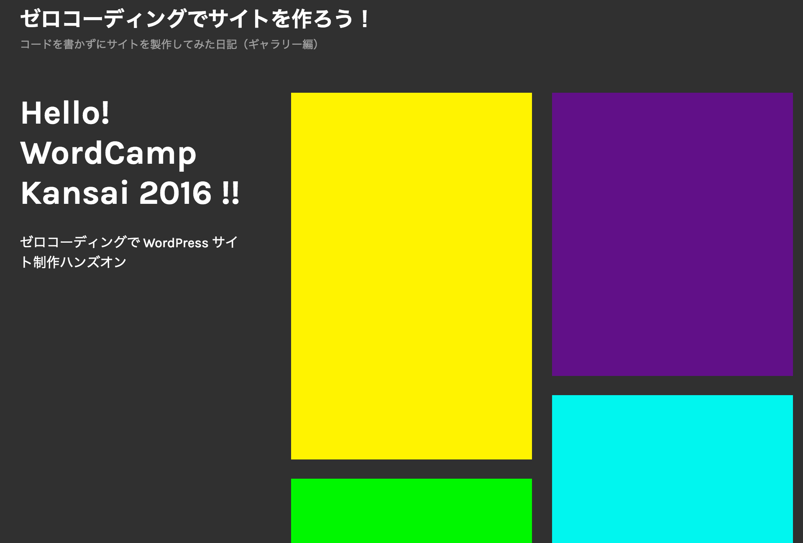

# ゼロコーディングで WordPress サイト制作ハンズオン

## ギャラリーサイト（写真・イラストが中心）

1. テーマをインストールしよう
  - テーマを検索してインストール
  - テーマをインストールし、有効化した時点で完成イメージとレイアウトが違いますよね？
1. テーマのサムネイルと同じレイアウトにするにはこのプラグインが必要です。
1. Jetpack をインストールしよう
  - もし Jetpack をインストール・有効化でつまずいたら
1. Jetpack「カスタム投稿タイプ」を使ってポートフォリオ機能を使うには
1. ナビゲーションの設定
1. 「ギャラリー機能」を拡張する
  - まずはデフォルトのギャラリーの表示を確認しましょう
  - このままだと味気ないので機能を追加します
1. OGP（ Open Graph protocol ）を設定

----

### 完成イメージ



### テーマをインストールしよう

#### テーマを検索してインストール

今回使用したテーマ: [Orvis](https://ja.wordpress.org/themes/orvis/)

1. ダッシュボード ＞ 外観 ＞ テーマ ＞ 新規追加 ＞ テーマを検索… に「Orvis」と入力します。
1. 「インストール」をクリック
1. 「有効化」をクリック

#### テーマをインストールし、有効化した時点で完成イメージとレイアウトが違いますよね？

テーマをインストールしただけでは、サムネイル通りのレイアウトにならないことがよくあります。  
今回のテーマの場合はあるプラグインをインストールし、テーマ側が持っている機能を有効化する必要がございます。

### テーマのサムネイルと同じレイアウトにするにはこのプラグインが必要です。

Jetpack by WordPress.com（以後 Jetpack）という多機能プラグインの「カスタム投稿タイプ」と呼ばれる機能を使用しないと、完成イメージのようなレイアウトにすることができません。

[Jetpack by WordPress.com](https://ja.wordpress.org/plugins/jetpack/)

### Jetpack をインストールしよう

1. ダッシュボード ＞ プラグイン ＞ 新規追加 ＞ プラグインの検索 に「Jetpack」と入力します。
1. 「Jetpack by WordPress.com（ 作成者: Automattic ）」と表示されたプラグインの「今すぐインストール」ボタンをクリック
1. 「プラグインを有効化」をクリック

#### もし Jetpack をインストール・有効化でつまずいたら

[こちらを確認](./flow-gallery-jetpack.md)

### Jetpack「カスタム投稿タイプ」を使ってポートフォリオ機能を使うには

1. Jetpack の設定画面から「カスタム投稿タイプ」を有効化
1. ダッシュボード ＞ 設定 ＞ 投稿設定 画面で「カスタムコンテンツタイプ」の設定項目が表示されていればOKです。
1. ダッシュボード ＞ ポートフォリオ ＞ 新規追加 を選択
1. 「タイトル」「アイキャッチ画像」を設定し「公開」します。  
※画像の用意がない場合は [こちら](https://github.com/wckansai2016/zerocoding-hands-on/archive/master.zip) から zip ファイルをダウンロードし、画像をアップロードしてください。  
（ zip ファイルを展開後、`zerocoding-hands-on-master/images/sample_picture/` に画像が格納されてます。 ）
1. ダッシュボード ＞ 固定ページ へ移動します。
1. ダッシュボード ＞ 固定ページ ＞ 新規追加 を選択
1. 「タイトル」を入力し、コンテンツ部分に以下を入力します。  
  ```
  ## Hello! WordCamp Kansai 2016 !!

  ゼロコーディングで WordPress サイト制作ハンズオン
  ```
1. 「ページ属性」項目のテンプレートを「ポートフォリオページテンプレート」に変更し「公開」します。
1. ダッシュボード ＞ 外観 ＞ カスタマイズ へ移動します。
1. 「固定フロントページ」の項目をクリック
  1. 「フロントページの表示」を「固定ページ」に
  1. 「フロントページ」をさきほど作成した固定ページ（タイトルが表示されてます）を選択します。
  1. 「保存して公開」ボタンをクリック


ページが一旦、完成しました。

---

### ナビゲーションの設定

1. ダッシュボード ＞ 外観 ＞ メニュー を選択します
1. メニュー名を記入し、「メニューを保存」をクリック
1. 左の画面から適宜メニューに追加したい項目を選択して「メニューに追加」をクリック
1. 右画面の「メニュー設定」の項目の「メインメニュー」を選択し、再度「メニューを保存」をクリック
1. ページを確認します。

ナビゲーションの設定が完了しました。  
「メニュー設定」の項目の「メインメニュー」はテーマによって名前が異なりますので、適宜確認してください。

### 「ギャラリー機能」を拡張する

プラグイン「Easy FancyBox」と Jetpack の「タイルギャラリー」を組み合わせて、WordPress のギャラリー機能を拡張します。

[Easy FancyBox](https://ja.wordpress.org/plugins/easy-fancybox/)

#### まずはデフォルトのギャラリーの表示を確認しましょう

1. ダッシュボード ＞ 投稿 ＞ 新規投稿 を選択します
1. 「メディアを追加」を選択し「ギャラリーを作成」をクリック
1. 適宜画像を選択し、「ギャラリーを挿入」をクリック
1. 「ギャラリーの設定」の「リンク先」を「メディアファイル」を選択し、再度「ギャラリーを挿入」をクリック
1. 「公開」ボタンをクリックし、投稿内容を確認してください。

#### このままだと味気ないので機能を追加します

1. まずは「Easy FancyBox」をインストールします。
1. ダッシュボード ＞ プラグイン ＞ 新規追加 ＞ プラグインの検索 に「Easy FancyBox」と入力します。
1. 「Easy FancyBox（ 作成者: RavanH ）」と表示されたプラグインの「今すぐインストール」ボタンをクリック
1. 「プラグインを有効化」をクリック
1. この状態でさきほど投稿した記事を確認してください。画像クリックで画像がライトボックスで表示されたと思います。
1. 続いて Jetpack の設定画面から「タイルギャラリー」を有効化します。
1. ダッシュボード ＞ 投稿 ＞ 新規投稿 を選択します
1. 「メディアを追加」を選択し「ギャラリーを作成」をクリック
1. 適宜画像を選択し、「ギャラリーを挿入」をクリック
1. 「ギャラリーの設定」の「リンク先」を「メディアファイル」を選択します
1. 「ギャラリーの設定」に「種類」という項目が追加されてます。  
こちらを「タイルモザイク」もしくは「タイルカラム」を選択し、再度「ギャラリーを挿入」をクリック
1. 「公開」ボタンをクリックし、投稿内容を確認してください。


さらに、


1. ダッシュボード ＞ ポートフォリオ ＞ 新規追加 を選択
1. 「タイトル」「アイキャッチ画像」を設定し、コンテンツに「メディアを追加」からギャラリーを作成（手順は先程と同じ）

こうすると TOP ページには画像一覧が表示されているので、その先にギャラリー投稿した内容があれば、例えば

- TOP ページに写真 A シリーズの代表的な一枚
- 投稿ページには A シリーズの写真すべて

といった構成のサイトが作成できるのではないでしょうか。

### OGP（ Open Graph protocol ）を設定

せっかくのギャラリーサイトを作成したので、SNS で拡散されたいですよね？  
OGP（ Open Graph protocol ）と呼ばれる規格を設定しておくと SNS で投稿された内容がリッチに表示されます。  
設定は簡単です。

1. Jetpack の設定画面から「パブリサイズ共有」を有効化します。

これだけで、投稿した内容に「 OGP タグ」と呼ばれる HTML タグが自動でページのソースに付与されます。

また以下のプラグインでも OGP の設定を行うことができます。

[Yoast SEO](https://ja.wordpress.org/plugins/wordpress-seo/)  
[All in One SEO Pack](https://srd.wordpress.org/plugins/all-in-one-seo-pack/)

使いやすいプラグインを選択していただければいいかと思いますが、ここで気をつけなければならないのはプラグイン間の機能のバッティングです。

Jetpack の「パブリサイズ共有」と Yoast SEO を2つ同時に有効化していると一部の機能がバッティングすることがあります。  
恐らくこの場合は OGP タグが2箇所出力されると思います。

OGP タグが2箇所出力されても恐らくサイトの表示や挙動に直接影響はないと思いますが、これは OGP タグの出力に関することであって、サイトの表示や挙動に関連するようなプラグインの場合は機能がバッティングしていないか気をつけなければなりません。

##### その他

既存のサイトにギャラリー機能を埋め込みたい場合、今回のようにテーマ側がポートフォリオ機能が搭載されているとは限りません。

このような場合には、Foo Gallery と呼ばれるプラグインを使用しましょう。

[Foo Gallery](https://wordpress.org/plugins/foogallery/)

----

[ハンズオンの流れページに戻る](https://github.com/wckansai2016/zerocoding-hands-on/blob/master/README.md#ハンズオンの流れ)
